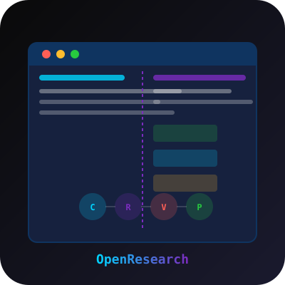

# OpenResearch



A non-delusional, critical thinking partner for entrepreneurs and creators — terminal-based multi-agent research TUI.

## Features

- **Split-pane TUI**: Chat/research log on the left, persistent canvas/workspace on the right
- **5-Phase Process**: Discovery → Validation → Analysis → Verdict → Planning
- **Multi-Agent System**:
  - **Critic** — challenges assumptions and forces specificity
  - **Researcher** — gathers real-world evidence from web, Reddit, and X
  - **Validator** — gives a brutal, honest verdict (worth pursuing or waste of time)
  - **Planner** — creates realistic, phase-based action plans
- **Local SQLite Storage**: All projects, messages, and canvas items stored locally
- **Provider-Agnostic LLM**: Supports OpenAI, Anthropic, OpenRouter, LM Studio, and Ollama
- **Search Integrations**: Tavily, SerpAPI, Reddit, and X/Twitter
- **Keyboard-Driven**: Ctrl+N (new project), Ctrl+O (open), Ctrl+S (save), Tab (switch focus), Ctrl+P (command palette)

## Installation

```bash
npm install
```

## Usage

```bash
npm run dev
```

## Configuration

Settings are stored in `~/.config/openresearch/config.json`:

- `provider`: LLM provider (`openai`, `anthropic`, `openrouter`, `lmstudio`, `ollama`)
- `apiKey`: API key for the selected provider
- `model`: Model name (e.g., `gpt-4o-mini`, `claude-3-5-sonnet-20240620`)
- `baseUrl`: Custom base URL (for OpenRouter, LM Studio, Ollama)
- `tavilyApiKey`: Tavily search API key
- `redditClientId` / `redditClientSecret`: Reddit API credentials
- `xBearerToken`: X/Twitter Bearer Token

## Controls

- `Ctrl+P` — Command palette (Settings, New Project, Open Project, Focus panels)
- `Ctrl+N` — New project
- `Ctrl+O` — Open next project
- `Ctrl+S` — Save
- `Tab` — Switch focus between Chat and Canvas panels
- `Enter` — Submit input
- `Esc` — Close modals

## Architecture

```
src/
  agents/
    index.ts          - Critic, Researcher, Validator, Planner agents
  llm/
    client.ts         - Unified LLM client with provider routing
    providers/        - OpenAI, Anthropic, OpenRouter, LM Studio, Ollama
  db/
    database.ts       - SQLite database with better-sqlite3
  services/
    search.ts         - Web, Reddit, and X search integrations
  config/
    settings.ts       - Configuration management with conf
  app/
    App.tsx           - Main TUI layout
    ChatPanel.tsx     - Left panel: conversation log and input
    CanvasPanel.tsx   - Right panel: findings, plans, verdicts
    CommandPalette.tsx - Ctrl+P command palette
    SettingsPanel.tsx - Runtime settings editor
    ProjectModal.tsx  - New/open project modal
  types.ts            - Core TypeScript interfaces
```

## License

MIT
